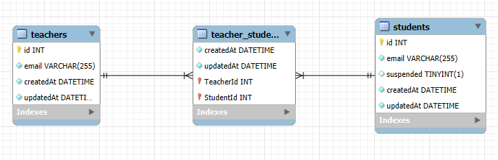
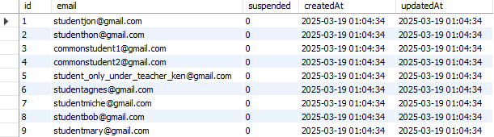
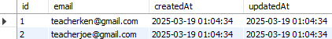
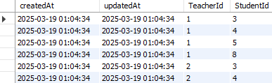

## Database Schema Diagram



---

# **Initial Data**

### **Students**



### **Teachers**



### **Teacher_Student**

## 

---

# **API Server Setup Guide On Windows**

## Prerequisites

Ensure you have the following installed before proceeding:

- **Node.js** `>= 20.15.1`
- **NPM** `>= 10.7.0`
- **MySQL** (Ensure MySQL service is running)

---

## Getting Started

Follow these steps to run the API server locally:

### **1. Create the Project Folder**

- Open Windows Command Prompt and create destination foler:

  ```sh
  mkdir [your-folder-path]
  ```

  e.g.

  ```sh
  mkdir D:\nowo-assessment
  ```

### **2. Clone the Repository**

- Go to inside the folder

  ```sh
  cd /d D:\nowo-assessment
  ```

  - Clone the repository

  ```sh
  git clone https://github.com/nowoadisuryo/nodejs-assessment.git
  cd nodejs-assessment
  ```

### **3. Set Up Environment Variables**

- Create a .env file by copying .env.example:
  ```sh
  copy .env.example .env
  ```
- Open the .env file through file explorer or command prompt.
- Edit the .env file and configure the following:

  ```sh
  DB_USER=<your_mysql_username>
  DB_PASS=<your_mysql_password>
  DB_HOST=<your_mysql_host>
  DB_PORT=<your_mysql_port>
  ```

### **4. Install Dependencies**

- Before installing the dependencies, please update your npm version. Run the following command in Windows Command Prompt:

  ```sh
  npm install -g npm@11.2.0
  ```

- Run the following command in Windows Command Prompt:

  ```sh
  npm install
  ```

### **5. Seed the Database**

- Ensure MySQL is running.
- Create the database manually:

  - Open MySQL Workbench or any MySQL client.
  - Connect to the MySQL server and then execute this query:

    ```sh
    CREATE DATABASE IF NOT EXISTS `nowo_nodejs_assessment`;
    ```

- Run the database seed data:
  ```sh
  npm run seed
  ```

### **6. Run Test Coverage**

```sh
npm run test:coverage
```

### **7. Start the Server**

```sh
npm start
```

The server should now be running.

---

## Available Scripts

| Command                 | Description                               |
| ----------------------- | ----------------------------------------- |
| `npm install`           | Installs all dependencies                 |
| `npm start`             | Starts the API server                     |
| `npm run dev`           | Starts the API server in development mode |
| `npm run seed`          | Seeds the database with initial data      |
| `npm run test`          | Runs the test suite                       |
| `npm run test:coverage` | Runs tests with coverage report           |
| `npm run lint`          | Runs ESLint to check code quality         |
| `npm run lint:fix`      | Runs ESLint to fix the code quality       |
| `npm run format`        | Formats code using Prettier               |

---

## Linter

Since Windows and Unix/Linux/macOS has different end of a line (Windows use CRLF and Unix/Linux/macOS use LF) please run `npm run format` before running `npm run lint`.

---

## Endpoints

## Prerequisites

Ensure you have the following before proceeding:

- Installed the latest version of **Postman** ([download](https://www.postman.com/downloads/))
- Imported the **Postman Collection** from the repository (api.postman_collection.json)

### **1. Register one or more students to a specified teacher.**

- Local Endpoint: `POST http://localhost:3000/api/register`
- Cloud Endpoint: `POST http://13.250.41.38:3000/api/register`
- Headers: `Content-Type: application/json`
- Success response status: HTTP 204
- Request body example:

```
{
  "teacher": "teacherken@gmail.com",
  "students":
    [
      "studentjon@gmail.com",
      "studenthon@gmail.com"
    ]
}
```

### **2. Retrieve a list of students common to a given list of teachers.**

- Local Endpoint: `GET http://localhost:3000/api/commonstudents`
- Cloud Endpoint: `GET http://13.250.41.38:3000/api/commonstudents`
- Success response status: HTTP 200
- Request example: `GET /api/commonstudents?teacher=teacherken%40gmail.com`
- Success response body:

```
{
  "students" :
    [
      "commonstudent1@gmail.com",
      "commonstudent2@gmail.com",
      "student_only_under_teacher_ken@gmail.com"
    ]
}
```

### **3. Suspend a specified student.**

- Local Endpoint: `POST http://localhost:3000/api/suspend`
- Cloud Endpoint: `POST http://13.250.41.38:3000/api/suspend`
- Headers: `Content-Type: application/json`
- Success response status: HTTP 204
- Request body example:

```
{
  "student" : "studentmary@gmail.com"
}
```

### **4. Retrieve a list of students who can receive a given notification.**

- Local Endpoint: `POST http://localhost:3000/api/retrievefornotifications`
- Cloud Endpoint: `POST http://13.250.41.38:3000/api/retrievefornotifications`
- Headers: `Content-Type: application/json`
- Success response status: HTTP 200
- Request body example:

```
{
  "teacher":  "teacherken@gmail.com",
  "notification": "Hello students! @studentagnes@gmail.com @studentmiche@gmail.com"
}
```

- Success response body:

```
{
  "recipients":
    [
      "studentbob@gmail.com",
      "studentagnes@gmail.com",
      "studentmiche@gmail.com"
    ]
}
```

## Error Cases

### **1. Register one or more students to a specified teacher.**

- Local Endpoint: `POST http://localhost:3000/api/register`
- Cloud Endpoint: `POST http://13.250.41.38:3000/api/register`
- Headers: `Content-Type: application/json`
- Error response status: HTTP 404
- Request body example:

```
{
  "teacher": "teacherken@gmail.com",
  "students":
    [
      "notfound@gmail.com",
      "studenthon@gmail.com"
    ]
}
```

- Error response body:

```
{
    "error": "Some students are not found"
}
```

### **2. Retrieve a list of students common to a given list of teachers.**

- Local Endpoint: `GET http://localhost:3000/api/commonstudents`
- Cloud Endpoint: `GET http://13.250.41.38:3000/api/commonstudents`
- Error response status: HTTP 404
- Request example: `GET /api/commonstudents?teacher=notfound@gmail.com`
- Error response body:

```
{
    "error": "Some teachers are not found"
}
```

### **3. Suspend a specified student.**

- Local Endpoint: `POST http://localhost:3000/api/suspend`
- Cloud Endpoint: `POST http://13.250.41.38:3000/api/suspend`
- Headers: `Content-Type: application/json`
- Error response status: HTTP 404
- Request body example:

```
{
  "student" : "notfound@gmail.com"
}
```

- Error response body:

```
{
    "error": "Student is not found"
}
```

### **4. Retrieve a list of students who can receive a given notification.**

- Local Endpoint: `POST http://localhost:3000/api/retrievefornotifications`
- Cloud Endpoint: `POST http://13.250.41.38:3000/api/retrievefornotifications`
- Headers: `Content-Type: application/json`
- Error response status: HTTP 404
- Request body example:

```
{
  "teacher":  "notfound@gmail.com",
  "notification": "Hello students! @studentagnes@gmail.com @studentmiche@gmail.com"
}
```

- Error response body:

```
{
    "error": "Teacher is not found"
}
```

---
